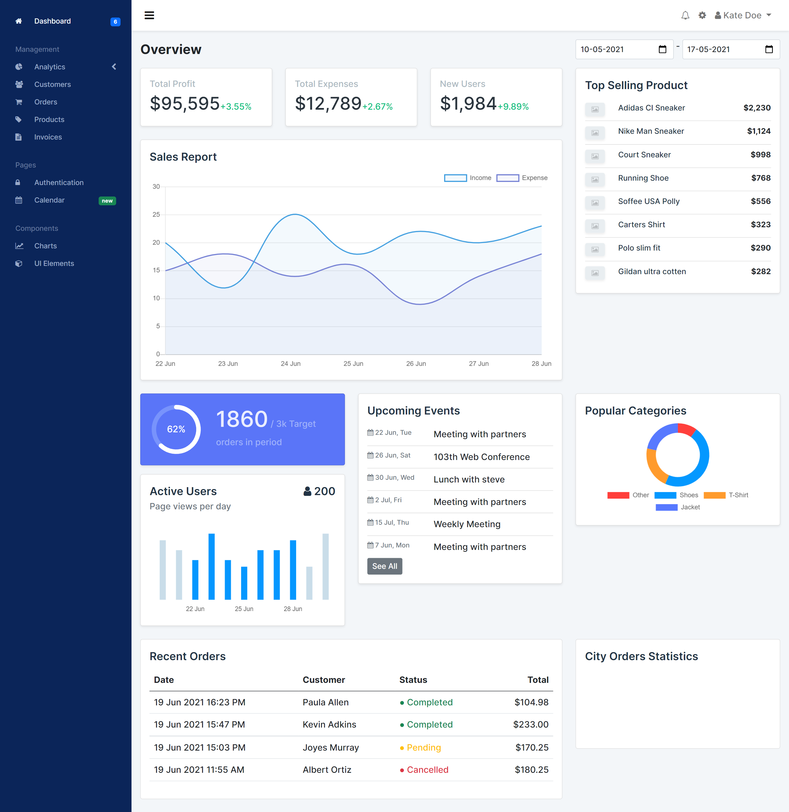

# Admin Dashboard


An admin dashboard template suitable for all kinds of applications. Built with angular following mobile first design. Its highly flexible and scalable.

The application demo is live at [admin-dashboard-mohitkh7.web.app](https://admin-dashboard-mohitkh7.web.app/)

## Features
- Fully responsive UI with mobile first approach.
- Compatible with all screen sizes.
- Wide range of UI components.
- Scalable design with modular angular components. 
- Interactive charts and animations.

## Built With
- [Angular 11](https://angular.io/)
- [Typescript](https://www.typescriptlang.org/)
- [Chart.js](https://www.chartjs.org/)
- [Bootstrap](https://getbootstrap.com/)
- [HTML](https://developer.mozilla.org/en-US/docs/Web/HTML)
- [CSS](https://developer.mozilla.org/en-US/docs/Web/CSS)

## Getting Started
### Prerequisites
* As we are using npm for package management, ensure its preinstalled in your system.
  ```sh
  npm install npm@latest -g
  ```

* Make sure you have the [Angular CLI](https://github.com/angular/angular-cli) installed globally.

### Installation

1. Clone the repo
   ```sh
   git clone https://github.com/mohitkh7/Admin-Dashboard.git
   ```
2. Install NPM packages to resolve all dependencies (might take a minute).
   ```sh
   cd admin-dashboard
   npm install
   ```
4. Run local server
   ```sh
   ng serve
   ```
   Navigate to `http://localhost:4200/`. The app will automatically reload if you change any of the source files.

5. Build the project
    ```sh
    ng build --prod
    ```
    The build artifacts will be stored in the `dist/` directory. Use the `--prod` flag for a production build.

## Inspiration
The UI of the application is inspired from a [Behance design](https://www.behance.net/gallery/101438923/Blueberry-CRM-Web-Dashboard) by [Okasana Kuzmenko](https://www.behance.net/oksi1325f04e)

## Contributing

Contributions are what make the open source community such an amazing place to be learn, inspire, and create. Any contributions you make are **greatly appreciated**.

## Contact
You can mail me any feedback or query at mohitkh7@gmail.com

- [Linkedin](https://www.linkedin.com/in/mohitkh7)

## Acknowledgements
* [Okasana Kuzmenko](https://www.behance.net/oksi1325f04e)
* [Font Awesome](https://fontawesome.com)
* [ng-circle-progress](https://www.npmjs.com/package/ng-circle-progress)
* [ng2-charts](https://www.npmjs.com/package/ng2-charts)